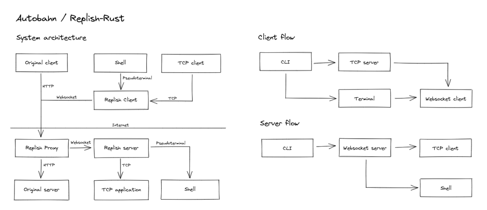

# Autobahn

**A remote shell, TCP tunnel and HTTP proxy for Replit.**

Hybrid SSH/HTTP server for Replit. Based on [leon332157/replish](https://github.com/leon332157/replish).

Autobahn runs a WebSocket server using a special protocol, connected to a TCP-WebSocket proxy server. Autobahn intercepts incoming traffic and redirects it either through to already-listening servers on the computer, or onto the WebSocket server.

Licensed under the GNU GPL (3.0 or later).

## Operation

At startup, Autobahn's server will either load a specified port from a configuration file, or scan directly for listening ports. The port eventually chosen - either automatically when only one, or by the user when multiple are detected - is forwarded to the proxy server.

The proxy server listens on port 3321, and detects HTTP packets from the stream. These HTTP are scanned, and rerouted to the Autobahn WebSocket server if they pointing to "/__atbws". Other packets are sent to the port passed from the initialiser.

The main Autobahn server is a WebSocket server listening on port 3322, and internally creates sessions and converts TCP sockets into WebSockets, before being passed onto the proxy server. The WebSockets use a special protocol which allows them to authenticate, pass messages, and create a remote shell or TCP tunnel.

## Architecture

